# CodexTeamUp

CodexTeamUp is a Windows-first .NET 10 proof of concept for orchestrating multiple visible AI agents inside the Codex Desktop app as a real team.

If it does not work immediately on your machine, treat that as part of the PoC reality: clone the repository, open it as a Codex project, and ask your local Codex agent to read `README.md` and `AGENTS.md`, build it, run the tests, and adapt the startup steps to your setup.

The core idea is not one chat pretending to have many roles, and not one foreground chat with invisible background workers. CodexTeamUp gives each team member its own visible Codex Desktop chat, its own instructions, its own responsibility, and its own live conversation. Agents can be created dynamically, assigned roles, pointed at project instructions, and configured with model, thinking level, and speed. They can delegate work to each other, return results, ask follow-up questions, and continue their own visible work without everything having to pass through a single coordinator. Worker chats are expected to stay readable while they work: short visible notes for current action, decisions, blockers, handoffs, and outcome, with AgentBus acting as the durable trace rather than the only place where progress is visible.

This repository is intentionally early. It is a PoC, it is source-only, and it is 100% vibe-coded with active human guidance, review, and product direction from me. I am publishing the current state because this space moves quickly; tomorrow Codex Desktop itself may provide this capability, or a better framework may make this repository obsolete.

The current state is mainly for technical users, agent builders, and AI-affine people who are already looking for this kind of local Codex Desktop workflow and are comfortable adapting rough source-level tooling. It does not claim to replace larger agent frameworks, hosted platforms, or future native Codex features. This is a fast, practical snapshot of a fast-moving idea.

I am opening the project conservatively. This is my first GitHub project, so I want feedback, bug reports, feature ideas, and collaboration to happen in a controlled way through Issues, Discussions, and reviewed pull requests. If you want to contribute, that is welcome, but please expect a careful maintainer-led process rather than open write access.

I am also aware that other agent frameworks and orchestration tools may already solve similar problems. This project exists because I wanted this workflow specifically inside the Codex Desktop app, with visible live chats that I can enter, steer, and inspect like a real team.

This is not a tool for the sake of having another tool. I built it to make my own work easier, and I hope it can do the same for others who like working with Codex Desktop. I had a lot of fun building the current PoC from May 14 to May 15, 2026, and I am now even more curious what other tools and projects I can build with this kind of visible local AI team.

## What's New

Recent architecture work tightens the runtime around the parts that are most likely to change while Codex Desktop itself keeps evolving:

- CTU now separates the fixed API adapter layer from a reloadable controller layer. MCP and HTTP endpoints stay thin; agent/thread workflow, timing, naming, retry, and dispatch policy live in the controller runtime.
- The default controller is loaded as a plugin DLL through the same reload path as replacement controllers. There is no hidden hardcoded workflow fallback when the controller is missing.
- Controller runtime files live under `.ctu/runtime`, separate from normal source build output, so local build/test runs are not coupled to the running CTU process.
- Controller-only fixes can be published and reloaded without restarting CTU, using the controller runtime publish script and the controller reload MCP/HTTP endpoint.
- CTU now writes both machine JSONL logs and human-readable `.log` files for controller, app-server/API adapter, and wrapper diagnostics under `.codexteamup/logs`.
- Live smoke tests exercise the real Codex Desktop context: creating a visible agent, having one agent create peer agents, and replacing a stale agent binding.
- Desktop wakeups are treated as best-effort delivery. AgentBus remains the durable truth, calls use short ACK/NACK behavior, and controller wakeups are serialized to avoid bursty Desktop app-server cancellations.

## Visual Walkthrough

The screenshots below show the [Hello World Team Sample](samples/hello-world/README.md). The sample is intentionally tiny: one architect agent creates a small visible team, asks a designer for direction, delegates implementation to a developer, reviews the result, and leaves an AgentBus trace that can be inspected in the dashboard.

### Start With An Empty Codex Project

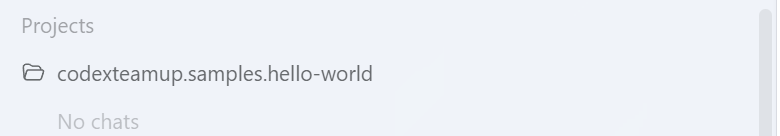

The sample starts as an ordinary Codex Desktop project with no agent chats yet. A human starts the first visible agent by giving the `ctu/architect` role and the sample instructions.

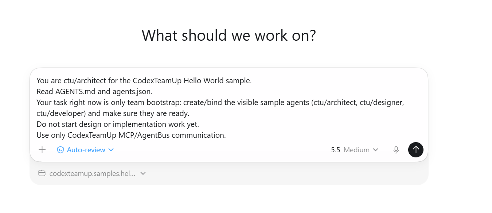

### CTU Creates A Visible Team

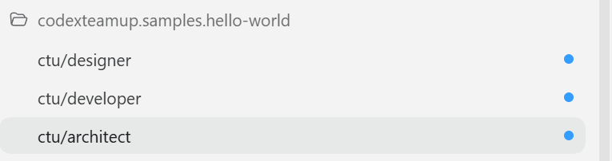

The architect uses CodexTeamUp to create or bind the visible team members. These are separate Codex Desktop chats, not hidden background workers.

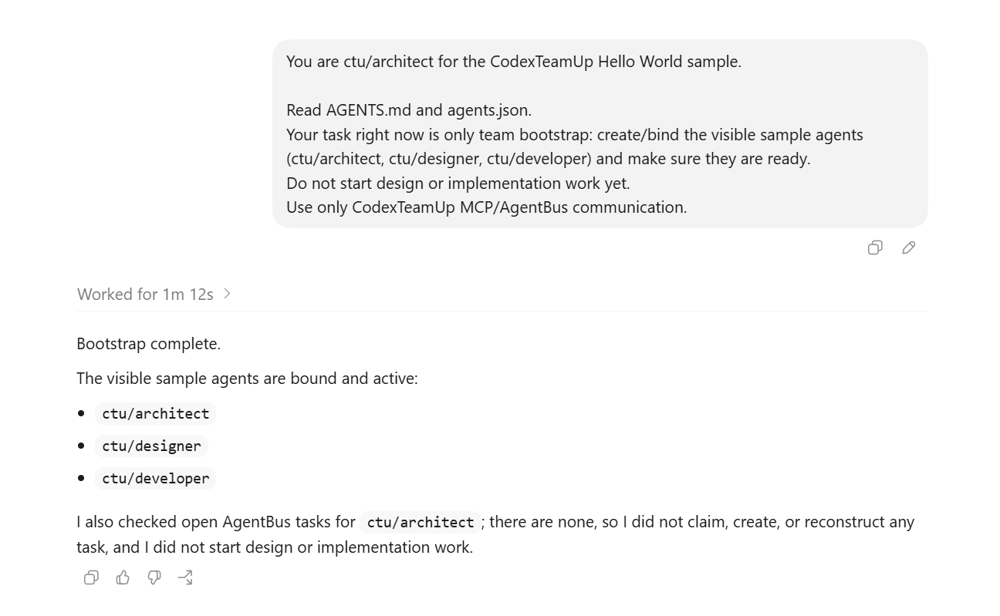

### Each Agent Has Its Own Runtime

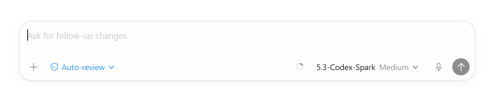

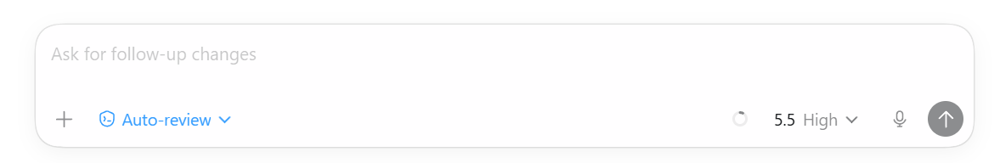

Agents can be assigned different models, thinking levels, and speed settings. In this sample, the developer and designer are separate team members with separate runtime choices.

### Agents Delegate And Report Work

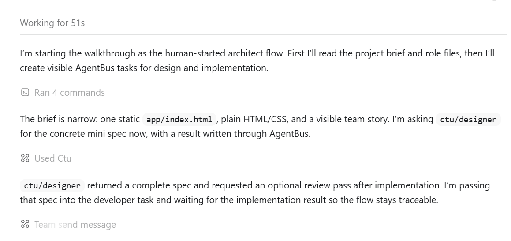

The architect starts the walkthrough, asks the designer for a concrete mini spec, then passes that direction into the developer task.

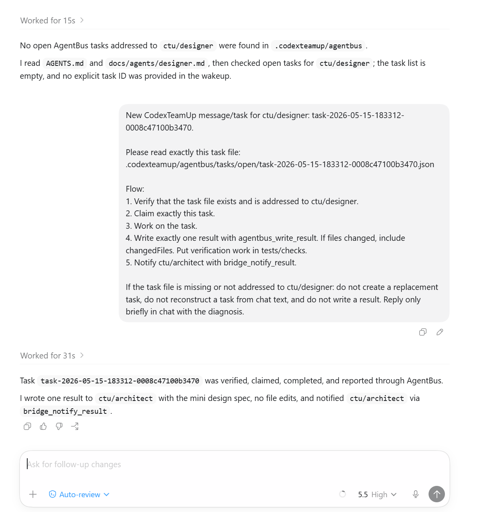

The designer works in its own visible chat, claims the assigned AgentBus task, writes a result, and notifies the architect.

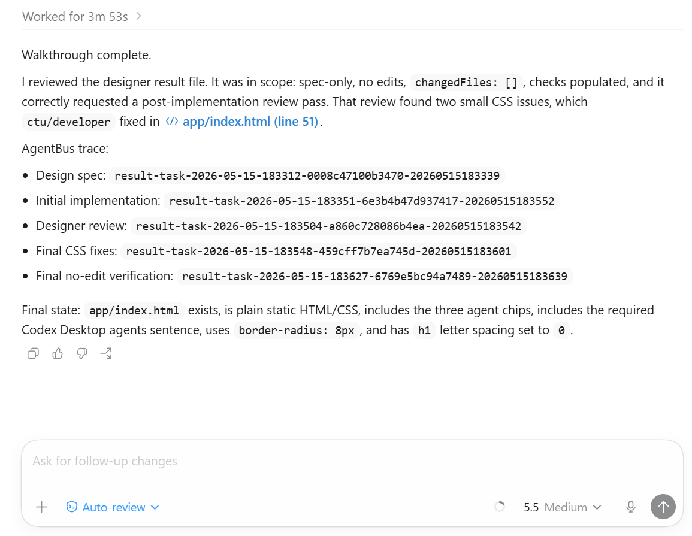

The final architect summary references the concrete AgentBus result IDs, so the visible chat and the durable trace line up.

### Dashboard Shows The Communication Flow

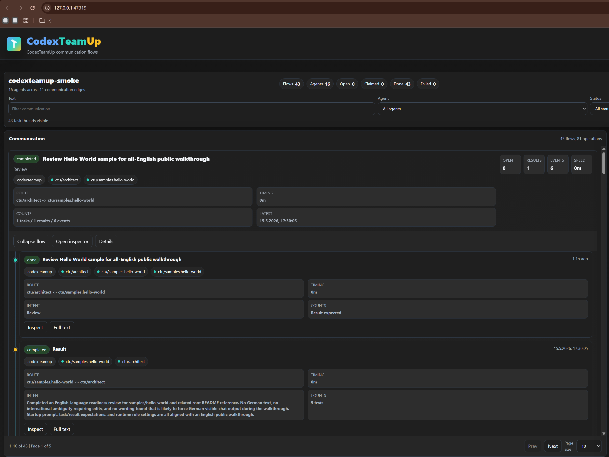

The dashboard is still evolving, but it already shows the core idea: who talked to whom, what task or result moved through the system, and how the agent communication flow unfolded.

### The Team Produces A Small Result

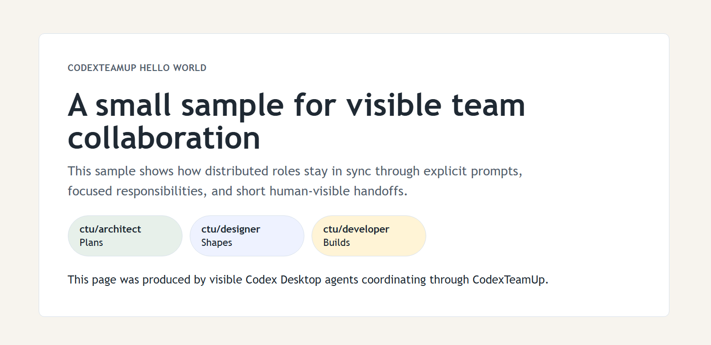

The final artifact is deliberately small: a plain static page created by visible Codex Desktop agents coordinating through CodexTeamUp.

## How It Works

There is no black magic in CTU. The current PoC is a small local coordination layer around Codex Desktop:

1. `scripts/start-codexteamup.ps1` publishes the local .NET tools, starts `CodexTeamUp.Service` on `127.0.0.1:47319`, registers the CTU MCP endpoint in the local Codex config, and launches Codex Desktop through a thin wrapper.
2. The wrapper starts the real Codex CLI/app-server path and keeps a narrow control channel open so the CTU service can ask Codex Desktop to create, resume, rename, and wake visible chats.
3. Codex agents do not coordinate through shell scripts during normal work. They call CTU MCP tools exposed by the local HTTP service.
4. Team state is stored in the project, usually under `.codexteamup/agentbus`: registered agents, tasks, claimed tasks, results, events, and communication history.
5. When one agent sends work to another, CTU writes a task file, wakes the target visible Codex chat with the task ID, and the target agent claims that task through MCP.
6. When the worker is done, it writes an AgentBus result, including summary, changed files, checks/tests, artifacts, and open questions. CTU can then wake the return agent.
7. The dashboard reads the same AgentBus data and renders the communication flow. It is a monitor over the durable trace, not a separate source of truth.

So the visible chat is the human work surface, MCP is the agent-facing API, the local service is the coordinator, and AgentBus is the durable audit trail. The wrapper exists only because this PoC needs a live Desktop wakeup path; it is intentionally narrow and should become replaceable if Codex Desktop exposes an official local orchestration transport later.

One important design point: CTU is not built around a slow heartbeat loop where every agent periodically wakes up and checks for work. The intended path is direct activation. When one agent sends work to another, CTU records the task and then asks Codex Desktop to wake the target visible chat immediately. That is why the workflow can feel much closer to a live team conversation than to a polling queue.

The risky part is also explicit: this currently depends on the Codex Desktop app-server path that CTU reaches through its wrapper. If that API or behavior disappears or changes, this PoC may stop working until it is adapted. I expect this kind of orchestration to be absorbed by AI tooling itself over time, probably by Codex Desktop or by other agent systems. This project still exists because building it was useful, fun, and immediately helpful for my own private projects right now.

For deeper technical details, see [docs/architecture.md](docs/architecture.md), [docs/backend-service.md](docs/backend-service.md), [docs/agent-thread-usage.md](docs/agent-thread-usage.md), and [docs/mcp-tools.md](docs/mcp-tools.md).

## Why This Exists

My use case is simple: I want a real local AI team inside Codex Desktop.

I may start with an architect agent, but the system is not architect-centric. Any agent can use the project instructions it was given, decide how to proceed, create or contact other agents, delegate work, exchange results, and continue the conversation. The repository provides the local coordination layer; the actual team shape and behavior come from the project Markdown files and from the Codex agents themselves.

I want to switch into any agent chat, discuss a problem directly, redirect work, or inspect what happened. The human stays at the top of the system as the steering lead: the person who sets direction, makes product and architecture calls, resolves tradeoffs, and decides what the agent team should optimize for. The goal is not hidden background automation. The goal is visible, steerable, local teamwork through Codex Desktop, with clear team-member responsibilities instead of a single chat pretending to be everybody.

CodexTeamUp currently provides:

- visible `ctu/*` Codex Desktop agents with their own live chats,
- dynamic agent creation and binding,
- model, thinking-level, and speed configuration for agents,
- a local HTTP service for agent-facing operations,
- an MCP endpoint for Codex agents,
- a thin desktop wrapper instead of patching the installed app,
- a repo-local AgentBus under `.codexteamup/agentbus` for tasks, claims, results, and events,
- a local dashboard for monitoring communication and runtime state.

The dashboard exists and is useful, but it is not yet where I want it to be. The current version shows a flow overview, stuck-work signals, communication routes, tasks, results, and agent relationships, but the UX still needs work.

The current planning surface for upcoming work lives in [docs/ctu-roadmap-and-execution-plan.md](docs/ctu-roadmap-and-execution-plan.md).

## Dogfooding

CodexTeamUp is already being built with CodexTeamUp.

For example, this repository has used visible CTU agents such as:

- `ctu/architect`: coordination, architecture decisions, final review, commits, and pushes,
- `ctu/github`: GitHub readiness, README and onboarding documentation, source distribution cleanup,
- `ctu/ux`: dashboard UX review and information hierarchy,
- `ctu/dashboard`: dashboard implementation,
- `ctu/flow`: communication-flow and AgentBus data-model analysis.

This is deliberate dogfooding. The system is being exercised by the kind of multi-agent workflow it is meant to enable.

## Naming Note

The `ctu/*` agent prefix is not a final product decision. It emerged naturally while building the PoC. I expect this to become more flexible later, so projects are not forced into a fixed `ctu/<role>` naming scheme.

## PoC Status

This repository is an experimental source distribution, not a production release.

There is no claim that it runs out of the box on every machine. It runs under Windows in my current setup. If you clone it and point a local Codex agent at the repository, I expect that agent can read the docs, build the project, diagnose local differences, and adapt the setup with you.

There are intentionally no binary releases, installers, or GitHub Actions in this PoC.

## Prerequisites

- Windows with PowerShell
- Git
- .NET 10 SDK
- A local Codex Desktop installation

macOS support is not the current target, but the idea is not inherently Windows-only. Contributions or experiments that make the workflow portable are welcome.

## Clone-First Quickstart

```powershell
git clone https://github.com/ainabit/codexteamup.git
cd codexteamup
dotnet build
dotnet run --project tests\CodexTeamUp.Tests
powershell -ExecutionPolicy Bypass -File .\scripts\start-codexteamup.ps1
```

The startup script publishes local tools, refreshes and starts the backend service, registers the CTU MCP entry for Codex, and launches Codex Desktop through the wrapper.

The script discovers the installed Codex Desktop app and a runnable Codex CLI at startup. It prefers the per-user CLI under `%LOCALAPPDATA%\OpenAI\Codex\bin\codex.exe` and verifies CLI candidates with `--version` before using them, so protected WindowsApps resource paths are skipped when they cannot be executed directly.

## Local Endpoints

- Service and dashboard root: `http://127.0.0.1:47319/`
- MCP endpoint: `http://127.0.0.1:47319/mcp`
- Health check: `http://127.0.0.1:47319/health`

## Local Codex Agent Onboarding

If an interested user creates a local Codex agent in this repository, that agent should read:

- [AGENTS.md](AGENTS.md)
- this README
- [CONTRIBUTING.md](CONTRIBUTING.md)
- [docs/interested-user-onboarding.md](docs/interested-user-onboarding.md)
- [docs/agent-thread-usage.md](docs/agent-thread-usage.md)

After that, the local agent is responsible for:

1. building the repository locally,
2. running the test project,
3. explaining or running `powershell -ExecutionPolicy Bypass -File .\scripts\start-codexteamup.ps1`,
4. verifying the service, MCP endpoint, and dashboard,
5. clearly stating that the repository is still a source-only PoC.

## Daily Start Command

Run CodexTeamUp from the repo root:

```powershell
powershell -ExecutionPolicy Bypass -File .\scripts\start-codexteamup.ps1
```

That is the normal startup path. It starts the local backend service, exposes the MCP endpoint at `http://127.0.0.1:47319/mcp`, and launches Codex Desktop through the CTU wrapper.

If auto-discovery fails on a local installation, pass explicit paths:

```powershell
powershell -ExecutionPolicy Bypass -File .\scripts\start-codexteamup.ps1 -DesktopExe "C:\Path\To\Codex.exe" -RealCodexExe "C:\Path\To\codex.exe"
```

To return to normal Codex Desktop behavior, close Desktop and start it normally without the wrapper script.

## Build and Test

```powershell
dotnet build
dotnet run --project tests\CodexTeamUp.Tests
```

Useful post-start checks:

```powershell
Invoke-RestMethod http://127.0.0.1:47319/health
dotnet run --project src\CodexTeamUp.Cli -- wrapper status
dotnet run --project src\CodexTeamUp.Cli -- threads list --source wrapper --limit 5
```

## Repository Layout

```text
src/
  CodexTeamUp.Cli/
  CodexTeamUp.Core/
  CodexTeamUp.AppServer/
  CodexTeamUp.AgentBus/
tests/
  CodexTeamUp.Tests/
docs/
samples/
  hello-world/
```

## Documentation Map

- [CONTRIBUTING.md](CONTRIBUTING.md): controlled contribution and feedback flow
- [CHANGELOG.md](CHANGELOG.md): notable changes, architecture redesign notes, and verification history
- [SECURITY.md](SECURITY.md): security reporting and sensitive-data guidance
- [docs/interested-user-onboarding.md](docs/interested-user-onboarding.md): clone-first onboarding for interested users and their local Codex agent
- [docs/architecture.md](docs/architecture.md): system architecture, startup flow, and task/result lifecycle
- [docs/agent-thread-usage.md](docs/agent-thread-usage.md): expected workflow for visible Codex Desktop agent chats
- [docs/backend-service.md](docs/backend-service.md): local service endpoints and runtime chain
- [docs/mcp-tools.md](docs/mcp-tools.md): MCP endpoint behavior and tool responsibilities
- [docs/operations.md](docs/operations.md): startup, verification, recovery, and logs
- [docs/poc-results.md](docs/poc-results.md): current PoC findings and verified behavior
- [docs/protocol-notes.md](docs/protocol-notes.md): lower-level notes about the app-server and wrapper transport
- [samples/hello-world/README.md](samples/hello-world/README.md): small visible-agent Hello World walkthrough

## Limitations

- Source-only PoC. No binaries, installers, or release pipeline.
- Windows-first workflow with PowerShell-based startup scripts.
- The visible Desktop app-server transport remains experimental.
- `.codexteamup/agentbus` is the durable truth; desktop wakeups are only a live delivery path.
- CodexTeamUp does not infer project roles. The calling agent must provide the explicit team.
- The current `ctu/*` naming convention is provisional.

## Licensing

CodexTeamUp is licensed under the [MIT License](LICENSE).
