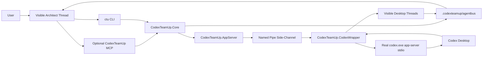

# CodexTeamUp Implementation Plan

Historical internal note: this document is a GitHub-ready English summary of the implementation plan that drove the PoC. It focuses on architecture, phases, and acceptance criteria rather than preserving every earlier German planning detail verbatim.

Status date: 2026-05-14.

## Current Status

As of 2026-05-14, the main plan is implemented at a PoC level:

- wrapper protocol helpers and a named-pipe app-server client exist,
- the CLI covers diagnostics, thread access, turn wait, AgentBus, dispatch, notify, delegate, and sample-project helper commands,
- AgentBus includes agent registry, tasks, claims, results, failed-task handling, events, locks, and result waiting,
- an optional `CodexTeamUp.Mcp` JSONL tool host exists,
- `CodexTeamUp.Service` provides the local HTTP backend and the MCP-facing service layer,
- repository docs cover architecture, API, AgentBus, wrapper transport, MCP, operations, and PoC findings,
- unit tests cover AgentBus, state reads, secret redaction, schema detection, wrapper protocol behavior, pipe clients, and the MCP registry.

The only intentionally non-automated part is the mutating live test against real Desktop threads. That remains a manual acceptance step with a dedicated test thread and explicit confirmation.

## Target Outcome

CodexTeamUp is meant to support a workflow like this:

```text
User talks to an architect thread
  -> architect creates an AgentBus task
  -> CodexTeamUp wakes a target thread through the Desktop side-channel
  -> ctu/web, ctu/designer, reviewer, or another worker works in its own visible thread
  -> target thread writes a result into .codexteamup/agentbus
  -> CodexTeamUp wakes the architect thread
  -> architect reviews the result, scope, and next steps
```

Key properties:

- each Codex thread keeps its own visible context window,
- the user can switch into any worker thread directly,
- delegation does not depend on copy and paste,
- large prompts and results live in files,
- `thread/resume` and `turn/start` are used only as wakeup mechanics,
- `.codexteamup/agentbus` stays the durable truth,
- MCP is an optional agent-friendly control layer, not the only path.

## Proven Starting Point

The PoC has already demonstrated the critical live Desktop breakthrough:

- Codex Desktop respects `CODEX_CLI_PATH`,
- `CodexTeamUp.CodexWrapper` can run as a CLI and app-server wrapper,
- the wrapper delegates to the real Codex CLI while exposing a named-pipe side-channel,
- app-server requests can be issued through that side-channel to the running visible Desktop app-server,
- `thread/list` and `thread/read` work,
- a persisted but unloaded thread needs `thread/resume` before `turn/start`,
- `turn/start` then works against a visible Desktop thread.

Known limitations:

- the expected Desktop control socket under `%USERPROFILE%\.codex\app-server-control` is currently absent,
- `codex app-server proxy` is a byte proxy, not a JSONL client,
- an external `CODEX_APP_SERVER_WS_URL` app-server does not currently provide a stable Desktop login and UI path,
- Desktop sorting behavior may need wrapper-side mitigations,
- the wrapper binary can be locked while Desktop is running, so a robust update strategy matters.

## Guardrails

Non-negotiable rules:

- no patching of the installed Codex Desktop app as the default solution,
- no secrets or auth material in logs,
- no mutating sends to live threads without explicit user action,
- mutating operations require confirmation unless `--yes` or an explicit policy allows them,
- no `danger-full-access` default,
- no silent work on other threads without a traceable AgentBus task,
- the wrapper stays technically narrow,
- business logic lives in Core, AppServer, AgentBus, CLI, and optional MCP layers.

## Target Architecture



Component responsibilities:

- `CodexTeamUp.CodexWrapper`: Desktop-compatible proxy and side-channel host
- `CodexTeamUp.AppServer`: stable client for wrapper-pipe and app-server calls
- `CodexTeamUp.AgentBus`: persistent tasks, prompts, claims, results, events, and locks
- `CodexTeamUp.Core`: models, ids, time, JSON, logging, errors, and safety helpers
- `CodexTeamUp.Cli`: the full operational interface for humans, scripts, and automation
- `CodexTeamUp.Mcp`: optional agent tools using the same core services

## AgentBus Shape

Target structure:

```text
.codexteamup/agentbus/
  agents.json
  tasks/
    open/
    claimed/
    done/
    failed/
  prompts/
  results/
  events.jsonl
  locks/
```

Core models:

- `AgentDefinition`
- `AgentTask`
- `AgentTaskClaim`
- `AgentResult`
- `AgentBusEvent`

Rules:

- task creation is append-only plus a file under `tasks/open`,
- claiming moves atomically from `open` to `claimed`,
- completion writes the result first, then the event, then moves the task to `done`,
- failure writes result and event, then moves the task to `failed`,
- events are append-only JSONL,
- locks prevent duplicate claims and conflicting writes,
- `allowedPaths` are required for delegated work,
- large prompts should live in markdown files.

## CLI Surface

Representative command groups:

```powershell
ctu codex info
ctu doctor
ctu wrapper status
ctu threads list --source wrapper
ctu threads read --thread-id <id> --include-turns
ctu threads send --thread-id <id> --message <text> --yes
ctu bus init
ctu bus agent register --id ctu/web --thread-id <id>
ctu bus task create --from ctu/architect --to ctu/web --title "..."
ctu bus task claim --task-id <id> --owner ctu/web
ctu bus result write --task-id <id> --status completed --summary "..."
ctu dispatch --task-id <id> --to-agent ctu/web --wait-result
ctu notify --result-id <id> --to-agent ctu/architect --yes
```

## MCP Surface

Representative tools:

- `agentbus_init`
- `agentbus_list_agents`
- `agentbus_register_agent`
- `agentbus_create_task`
- `agentbus_list_tasks`
- `agentbus_claim_task`
- `agentbus_write_result`
- `agentbus_wait_result`
- `bridge_dispatch_task`
- `bridge_notify_result`
- `team_create_agent`
- `team_ensure_agents`
- `team_discover_agents`
- `team_send_message`
- `team_dashboard_export`

## Phase Plan

### Phase 1: Wrapper and App-Server Stability

- keep the wrapper as a transparent stdio proxy,
- isolate bridge request ids,
- stabilize side-channel communication,
- maintain safe logging and redaction,
- define a wrapper publish strategy that tolerates a running Desktop process.

### Phase 2: Thread and Turn Operations

- keep reliable support for `thread/list`, `thread/read`, `thread/resume`, and `turn/start`,
- surface clear status for unavailable wrapper, unavailable Desktop, unloaded thread, active thread, and completed turn,
- preserve confirmation requirements for mutating actions.

### Phase 3: AgentBus Hardening

- stabilize task creation, claims, results, and events,
- keep offline task lifecycle behavior independent from live Desktop transport,
- preserve locks and append-only event history.

### Phase 4: Dispatch and Notify

- resolve agents to visible threads,
- read and validate task files,
- generate short wakeup messages,
- wake target threads through `thread/resume` and `turn/start`,
- notify return threads after results are written.

### Phase 5: Waiters and Delegation UX

- allow architect flows to wait on results when appropriate,
- keep low-latency question and answer flows practical,
- provide useful progress feedback.

### Phase 6: MCP Integration

- expose AgentBus and bridge operations as tools,
- keep MCP behavior aligned with the CLI,
- preserve bootstrap and recovery scripts as secondary paths only.

### Phase 7: Project Templates and Samples

- keep generic sample-project examples as a realistic downstream usage pattern,
- ship example prompts, tasks, and recovery guidance.

### Phase 8: Operational Hardening

- improve update safety,
- document start and restore procedures,
- rotate and redact logs,
- keep safe-mode behavior available when live Desktop sends should be disabled.

### Phase 9: End-to-End Validation

- start Desktop through the wrapper,
- verify wrapper visibility and target thread discovery,
- dispatch a task to a worker thread,
- observe the visible wakeup,
- observe the worker result,
- observe the architect wakeup,
- verify the communication trail in AgentBus.

## Acceptance Criteria

CodexTeamUp is successful when:

- local Codex threads can be listed,
- a concrete thread can be read,
- a persisted thread can be resumed,
- a visible thread can be woken through `turn/start`,
- a worker can write a result and wake the architect thread,
- the communication remains visible and auditable through AgentBus,
- MCP is useful but not required for core operation,
- CLI remains usable for testing and recovery.

## Main Risks

- Codex Desktop may change `CODEX_CLI_PATH` behavior or app-server protocols,
- Desktop UI sorting and pagination assumptions may change,
- experimental app-server methods may remain unstable,
- a target thread may already be active,
- approval or sandbox dialogs may block a worker thread,
- named-pipe access may be blocked by permissions or antivirus,
- wrapper binaries may be locked by a running Desktop process.

## Near-Term Next Steps

- keep the wrapper and side-channel stable,
- continue hardening request rewriting and response interception,
- extend tests for bridge behavior,
- maintain AgentBus-first coordination,
- only run mutating live Desktop tests with explicit consent and a dedicated test thread.
